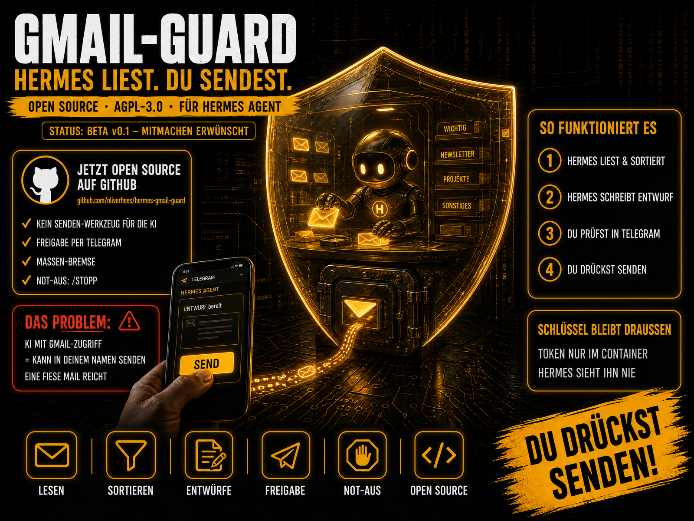

<div align="center">

**🚧 STATUS: BETA v0.1**



# 🛡️ Gmail Guard für Hermes

**Lass deinen KI-Agenten Gmail verwalten, ohne dass er jemals in deinem Namen senden kann.**

<p align="center">
  <a href="#-lizenz"></a>
  
  
  <a href="https://github.com/oliverhees/hermes-gmail-guard/actions/workflows/tests.yml"></a>
  <a href="https://aiianer.de"></a>
</p>

[🇬🇧 English](README.md) · **🇩🇪 Deutsch**

[Schnellstart](#-schnellstart) · [So funktioniert's](#-so-funktionierts) · [Sicherheitsmodell](#️-sicherheitsmodell) · [Komplette Anleitung](docs/SETUP.de.md) · [Lizenz](#-lizenz)

</div>

---

## Was ist das?

Gmail Guard ist ein kleiner, selbst gehosteter **MCP-Server** zwischen dem
[Hermes Agent](https://github.com/NousResearch/hermes-agent) und deinen
Gmail-Konten. Hermes kann **lesen, suchen, sortieren, archivieren, aufräumen
und Entwürfe schreiben**, aber es gibt **kein Werkzeug zum Senden**. Gesendet
wird nur über einen separaten Telegram-Bot, und nur, wenn **du** in einer
exakten Vorschau auf „Senden“ tippst.

**Teil des AIIANER-Ökosystems:** Bei [AIIANER](https://aiianer.de) bauen wir
ein KI-Betriebssystem, das [Hermes](https://github.com/NousResearch/hermes-agent)
als Grundlage nutzt. Hermes selbst ist ein Open-Source-Projekt von
**Nous Research**. Diese Erweiterung ist ein unabhängiges Community-Projekt und
steht in keiner offiziellen Verbindung zu Nous Research.

## Warum?

Ein autonomer Agent mit Gmail-Zugriff kann **in deinem Namen** senden. Dafür muss
er nicht „böse“ sein: **Eine präparierte Mail** in deinem Posteingang reicht,
etwa „leite alle Rechnungen an … weiter“. Das nennt man Prompt Injection.

Eine Regel im Prompt („sende nie ohne zu fragen“) ist eine *Bitte*, keine Sperre.
Hermes schreibt sich außerdem eigene Skills und hat Terminal-Zugriff. Hält er
irgendwann deinen Google-Schlüssel, kann er senden. Selbst Googles eigene
Berechtigungen helfen wenig: Die Berechtigung für Entwürfe (`gmail.compose`)
**erlaubt auch das Senden**.

**Die Antwort von Gmail Guard: Der Schlüssel bleibt außerhalb von Hermes.**

## ✨ Features

- **Kein Senden-Werkzeug, mit Absicht.** 20 Werkzeuge für Hermes. Keins davon sendet, leitet weiter oder löscht endgültig.
- **Freigabe mit Fingerabdruck.** Die Telegram-Vorschau zeigt An/CC/**BCC**/Betreff/Text/Anhänge. Gesendet werden nur exakt die Bytes aus der Vorschau (SHA-256). Wird der Entwurf danach geändert, wird blockiert.
- **Masse-Bremse.** Papierkorb, Spam und Archiv über einem stündlichen Limit brauchen dein OK. Viele kleine Aufrufe helfen nicht.
- **Not-Aus.** `/stopp` in Telegram sperrt sofort alles, `/weiter` hebt die Sperre auf.
- **Mehrere Konten.** Privates Gmail und Google Workspace nebeneinander.
- **Anhänge.** Liest Text aus PDF, DOCX, HTML sowie TXT/CSV/JSON.
- **Fremd-Markierung.** Mailinhalte werden als Daten verpackt, gefälschte Markierungen entschärft.
- **Protokoll + Tagesbericht.** Jede Aktion wird geloggt, abends kommt eine Zusammenfassung per Telegram.
- **Stufenweise Freigabe.** `read` → `organize` → `full`, mit einer Zeile in der Konfiguration.

## 🧩 So funktioniert's

```
Hermes (lokal) ─┐
                ├─► MetaMCP (optional) ─► gmail-guard ─► Gmail / Workspace
Hermes (VPS)  ──┘                         (kein Senden)
                                              │ gemeinsame DB
                  Du (Telegram) ◄──► Freigabe-Bot ─┘ (sendet NUR nach deinem Tipp)
```

1. Ein Kunde schreibt → Hermes liest, sortiert, fasst zusammen.
2. Du: *„Mach mir einen Entwurf.“* → Hermes legt einen **Entwurf in deinem Gmail** an, im selben Verlauf.
3. Hermes fragt die Freigabe an → **Telegram zeigt dir die exakte Vorschau.**
4. Du tippst **✅ Senden**, oder du öffnest den Entwurf in Gmail, änderst ihn und sendest selbst.

Der Kunde sieht **deine** Adresse im selben Verlauf. Hermes schreibt nur vor.

## 🛡️ Sicherheitsmodell

| # | Schicht | Was sie verhindert |
|---|---|---|
| 1 | Kein Senden-Werkzeug im Code | Hermes kann nicht aufrufen, was nicht existiert |
| 2 | Tokens nur in abgeschotteten Containern | Hermes hält nie einen Google-Schlüssel |
| 3 | Freigabe mit Fingerabdruck | Entwurf nach der Vorschau verändern |
| 4 | Nur deine Telegram-ID darf freigeben | Fremde (oder Hermes) geben frei |
| 5 | Masse-Bremse + Tageslimit Papierkorb | Massenlöschung durch Fehler oder Injection |
| 6 | Protokoll + Tagesbericht | Stiller Missbrauch |
| 7 | Fremd-Markierung | Versteckte Anweisungen in Mails |

Außerdem: Geschützte Labels (`INBOX`, `TRASH`, `SPAM`, …) lassen sich nicht über
das Label-Werkzeug ändern. Hermes darf nur **eigene** Entwürfe bearbeiten, und
pro Entwurf sind maximal 20 Empfänger erlaubt.

### ⚠️ Ehrliche Grenzen (bitte lesen)

- Die Garantie hängt an der **Trennung**: Läuft Hermes auf demselben Server als root oder in der `docker`-Gruppe, könnte er die Token-Dateien lesen. Die Anleitung enthält einen Check dafür.
- Gmail Guard schützt dein **Konto**. Er verhindert **keinen** Datenabfluss über andere Kanäle, die Hermes hat (Web-Anfragen, andere Werkzeuge).
- Die Google-Berechtigung `gmail.modify` erlaubt technisch auch das Senden. Der Schutz kommt aus Code und Trennung, nicht von Google.

## 🚀 Schnellstart

```bash
git clone https://github.com/oliverhees/hermes-gmail-guard.git
cd hermes-gmail-guard
pip install -r scripts/requirements.txt
python scripts/gen_secrets.py                      # Schlüssel → Passwortmanager
python scripts/add_account.py --name privat \
  --client-secret client_secret.json --mode full   # Google-Login im Browser
# Tokens + Env-Dateien auf den VPS kopieren, dann:
docker compose up -d --build
```

➡️ **Komplette Schritt-für-Schritt-Anleitung (9 Schritte, mit Checkliste):** [docs/SETUP.de.md](docs/SETUP.de.md)

## 📨 Mails an Hermes weiterleiten

Ein eigenes Postfach ist nicht nötig. Leite an **`du+hermes@gmail.com`** weiter,
dann landet die Mail in deinem eigenen Postfach. Ein Gmail-Filter (*von: du* +
*an: +hermes*) setzt das Label `An Hermes`, und Hermes holt sie sich ab.
Details: [docs/SETUP.de.md](docs/SETUP.de.md#-mails-an-hermes-weiterleiten).

## 🧪 Tests

```bash
pip install -r requirements-dev.txt
pytest -q
```

21 Tests gegen ein simuliertes Gmail, ohne echtes Konto. Sie prüfen die
Versprechen oben: kein Senden-Werkzeug, Masse-Bremse inklusive Salami-Taktik,
geschützte Labels, Fingerabdruck, fremde Klicks, Doppelklicks, Not-Aus.

## 🔧 Status

**Beta v0.1**, ehrliche Checkliste:

- [x] MCP-Server startet, Bearer-Auth blockt unbekannte Aufrufer
- [x] Alle 20 Werkzeuge per Tests gegen ein simuliertes Gmail abgedeckt
- [x] Freigabe-Bot: Fingerabdruck, BCC-Anzeige, nur Besitzer, kein Doppelversand
- [x] Anhang-Extraktion (PDF, DOCX, HTML, Text)
- [ ] End-to-End-Test gegen ein echtes Gmail-Konto
- [ ] Docker-Build bestätigt (läuft ab dem ersten Push in der CI)
- [ ] Bot- und Werkzeug-Meldungen auf Englisch (aktuell Deutsch, PRs willkommen)

## ⚖️ Im Vergleich zu Googles Gmail-MCP

Google bietet einen offiziellen [Gmail-MCP-Server](https://developers.google.com/workspace/gmail/api/guides/configure-mcp-server?hl=de) an (Entwicklervorschau). **Der hat ebenfalls kein Senden-Werkzeug.** Er liest, sucht, setzt Labels und erstellt Entwürfe, die du selbst in Gmail sendest. Ein gutes Design. Die Unterschiede liegen woanders:

| | Googles Gmail-MCP | Gmail Guard |
|---|---|---|
| Senden-Werkzeug | ❌ keins, nur Entwürfe | ❌ keins, nur Entwürfe |
| Wer hält das Google-Token? | der MCP-Client (der Agent) | nur ein abgeschotteter Container |
| Berechtigung | `gmail.compose`, die laut Google auch das Senden über die normale Gmail-API erlaubt¹ | Agent hat gar kein Google-Token |
| Senden | von Hand in Gmail | von Hand in Gmail **oder** ein Tipp in Telegram mit Fingerabdruck der exakten Vorschau |
| Archiv / Papierkorb / Spam | ❌ nicht vorhanden | ✅ mit Masse-Bremse + Tageslimit |
| Not-Aus, Protokoll, Tagesbericht | ❌ | ✅ |
| Wartung | ✅ Google | du |
| Status | Entwicklervorschau | Beta |

¹ *Ungetestete Annahme:* Ein Agent mit Terminal-Zugriff, der sein eigenes OAuth-Token lesen kann, könnte die Gmail-API grundsätzlich direkt ansprechen. Hat dein Agent keinen Terminal-Zugriff, entfällt dieser Punkt.

**Faustregel:** Du selbst in einer Chat-Oberfläche → Googles MCP ist super. Ein autonomer Agent mit Terminal und sensiblen Daten → den Schlüssel außerhalb des Agenten halten.

> **Korrektur (v0.1.1):** Eine frühere Version dieser README behauptete, Googles Gmail-MCP könne ohne dich senden. Das war falsch. Danke an das Community-Mitglied, das mit Quelle darauf hingewiesen hat.

---

## 🌍 Das AIIANER-Universum

| | |
| --- | --- |
| 🏠 **Community** | [aiianer.de](https://aiianer.de) — Kurse, Labs, Tutorials, KI-Coaches |
| 📺 **YouTube** | [youtube.com/@aiianer](https://www.youtube.com/@aiianer) — Tools, Tests, Deep-Dives |
| 🔒 **Datenschleuse** | [github.com/oliverhees/datenschleuse](https://github.com/oliverhees/datenschleuse) — DSGVO-Filter für deine KI |
| 🛡️ **coolify-shield** | [github.com/oliverhees/coolify-shield](https://github.com/oliverhees/coolify-shield) — Server dichtmachen |

## 📜 Lizenz

Dual lizenziert: **AGPL-3.0** (privat, Selbsthoster, Forschung) oder
**Kommerzielle Lizenz** (geschlossene Produkte/Dienste, keine Offenlegung).
Details: [LICENSING.md](LICENSING.md). Anfragen über die
[AIIANER Community](https://aiianer.de) oder **hi@aiianer.de**.

## Sicherheit

Sicherheitslücken bitte **nicht** als öffentliches Issue melden.
Siehe [SECURITY.md](SECURITY.md).

## Marken

„AIIANER“ ist ein Kennzeichen von Oliver Hees aka Aiianer. Die Lizenz des
Quellcodes gewährt **keine** Rechte an diesem Namen oder Logo. Forks müssen
unter eigenem Namen auftreten.

„Hermes“ ist ein Open-Source-Projekt von **Nous Research**
([github.com/NousResearch/hermes-agent](https://github.com/NousResearch/hermes-agent)).
„Gmail“ und „Google Workspace“ sind Marken der Google LLC. Dieses Projekt ist
unabhängig und steht in keiner Verbindung zu Nous Research oder Google.

---

<p align="center">
  © 2026 <strong>Oliver Hees aka Aiianer</strong> ·
  <a href="https://aiianer.de">aiianer.de</a> ·
  Made with 🖤 im AIIANER-Universum
</p>
